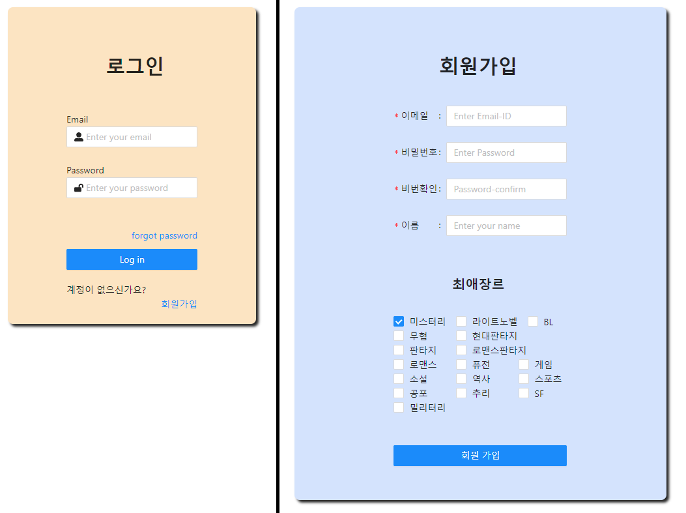
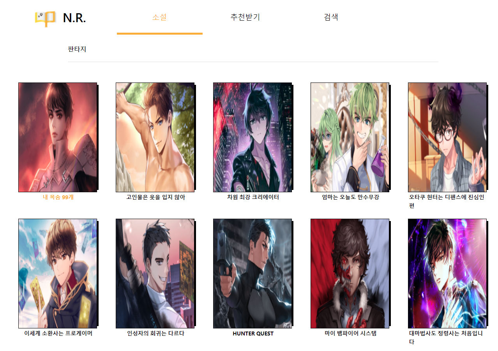
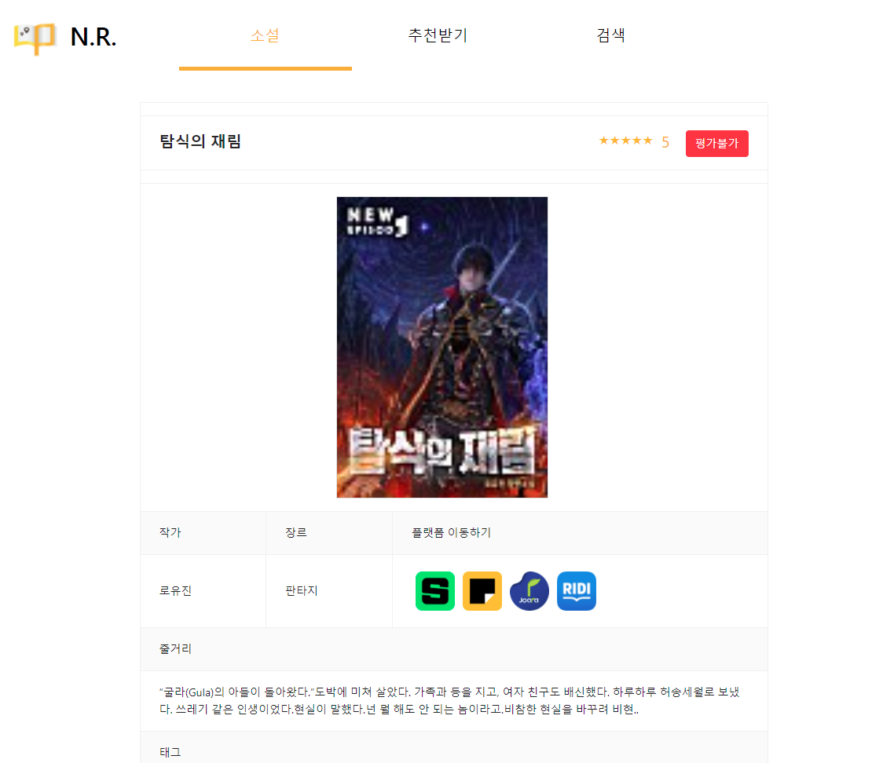
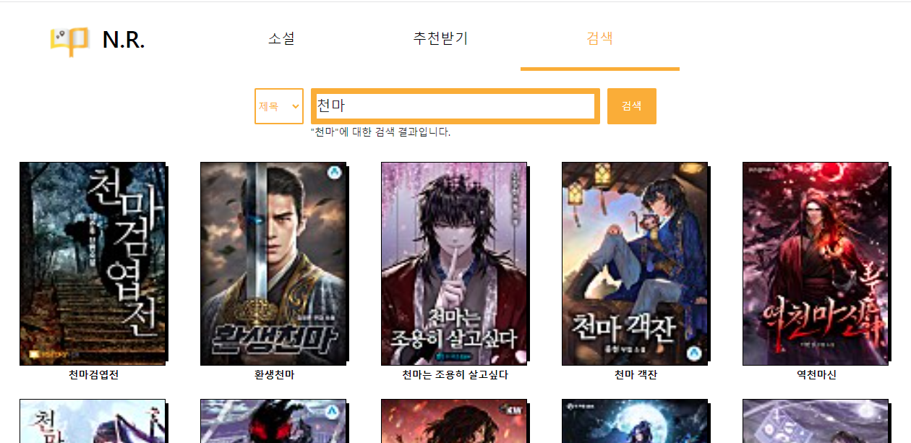
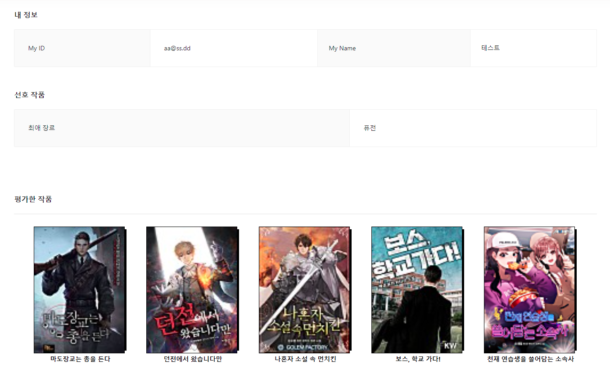
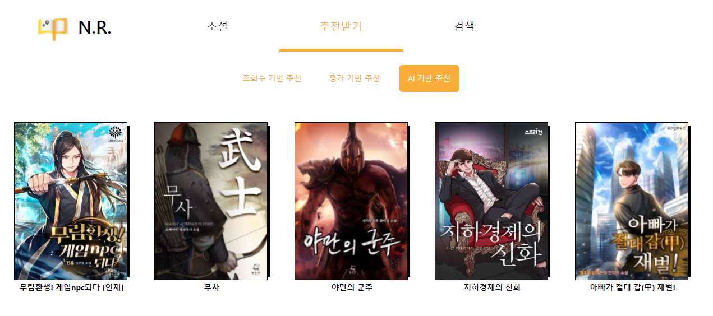

# 소설 추천 시스템

## 프로젝트 내용
본 프로젝트는 여러 웹 소설 플랫폼에 파편화되어 나누어져 있는 웹 소설들을 하나로 통합하여 서비스하는 것을 목표로 하였다.

웹 소설 시장이 발전함에 따라 소설들이 여러 플랫폼으로 파편화되었다. 이는 성향이 맞는 작품을 찾거나, 플랫폼 사용에 있어 여러 플랫폼을 이동해야하는 불편함이 있다.

이를 해결하기 위해, 내부적으로 분류한 정보를 바탕으로 웹 소설 플랫폼을 통합하는 시스템을 구현하고, 성향이 맞는 작품을 추천하는 기능을 구현하였다.

* 기본 회원 시스템
* 웹 소설 종합 및 메타데이터 처리
* 사용자 데이터 기반 추천 기능

<b>기간: 2021.04.05. ~ 2021.12.04(공부 기간 포함)</b>  
<b>인원 : 5인(Front 2, Back 3)</b>  
<b>구성: React, Node.js Express, AWS RDS MySQL, AWS EC2</b>  
<b>사용 기술: passport, KoNLPy, Recommendation Algorithm 등</b>  

 

# 담당 업무

* 회원 시스템 API
* 작품 출력 API
* 추천 알고리즘
* 기타 대부분의 API

 

# 기능

### <b>로그인 및 회원 가입</b>  
  

Node.js의 passport 모듈을 사용하여 시스템을 구현.  
아이디 중복 체크, 빈칸 확인 등의 기본적인 기능을 구현.

### <b>소설 리스트 출력</b>  
  

DB에 저장된 소설 목록을 요청된 설정에 따라 필터링하여 출력.  
클라이언트 부하를 줄이기 위해서, 한번에 20개씩 불러오도록 구현.  

### <b>소설 상세정보 출력</b>  
  

특정 소설에 대한 상세 정보(작가, 장르, 줄거리 등)를 DB에서 불러와 출력.  
사용자가 소설에 대해 평가를 할 수 있고, 플랫폼 아이콘을 클릭하면 해당 소설이 연재되는 곳으로 이동할 수 있도록 작성.

  

태그 정보는 줄거리를 '자연어 처리'한 DB의 데이터를 나타내도록 구현.

### <b>검색</b> 

  

소설에 대한 검색 기능

### <b>마이페이지</b>  

  

회원가입 시 입력한 정보와 사용자가 평가한 작품을 보여주도록 구현.

### <b>추천 페이지</b>  

  

조회수 기반 추천은 시스템 내에서 사용하는 DB 조회수에 따라 내림차순으로 작품을 출력.

평가 기반 추천은 사용자가 평가한 작품의 작가가 쓴 다른 소설을 출력.

AI 기반 추천은 사용자의 평가 데이터를 기반으로 컨텐츠 기반 필터링 알고리즘과 협업 필터링 알고리즘을 혼합한 하이브리드 필터링 알고리즘을 사용.

  

# 크롤링 사용법

## Crawler

### crawler_run.js

- 위 파일을 실행하면 네이버, 카카오페이지, 조아라, 리디북스 사이트의 소설 데이터를 크롤링하여 csv 폴더에 각각의 이름으로 저장하며, 크롤링된 csv 파일들을 가지고 하나의 csv 파일로 통합합니다.

### week_crawler_run.js

- 위 파일을 실행하면 네이버, 조아라, 리디북스 사이트의 주간 소설 데이터를 크롤링하여 csv 폴더에 각각의 이름으로 저장하며, 크롤링된 csv 파일들을 가지고 하나의 csv 파일로 통합합니다.

## NLP Tag

### insert_db

- 위 파일을 실행하면 crawler_run.js를 통해 생성된 csv 파일을 DB에 삽입합니다.

### run_pycode.js

- 위 파일을 실행하면 python으로 작성된 NLP 폴더의 novel_taging.py를 실행합니다.

### novel_taging.py

- 위 파일은 run_pycode.js에 의해 실행되며, 실행 시 DB에 있는 소설 데이터에 대한 NLP 작업(TAG 작업)을 진행하여 novel_tag 테이블에 INSERT 합니다.

### week_run_pycode.js

- 위 파일을 실행하면 python으로 작성된 NLP 폴더의 week_novel_taging.py를 실행합니다.

### week_novel_taging.py

- 위 파일은 week_run_pycode.js에 의해 실행되며, 실행 시 week_crawler_run.js에 의해 생성된 csv 파일은 DB에 삽입함과 동시에 삽입하는 소설에 대한 NLP 작업(TAG 작업)을 진행하여 해당 결과를 DB에 함께 INSERT 합니다.
